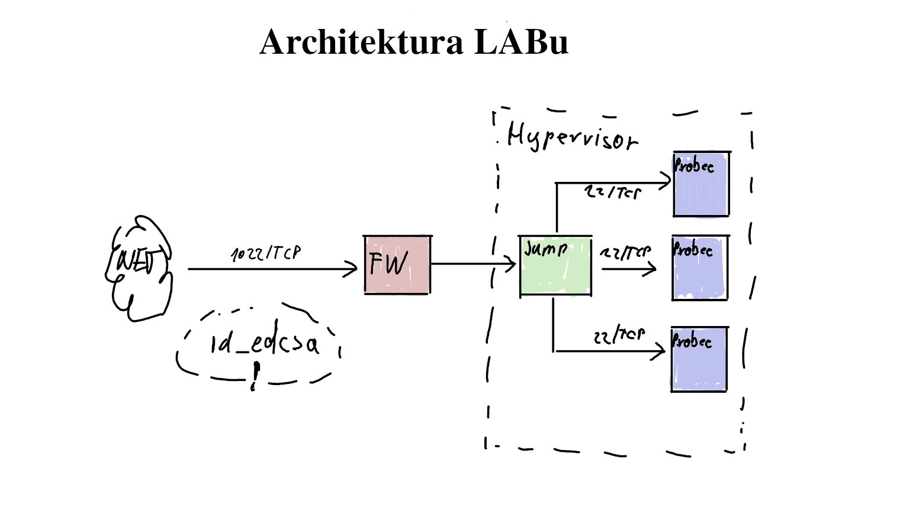

  

# Containers Labs

Toto repo obsahuje praktické laby určené ke školení a výuce práce s kontejnery (Docker / Podman).

## Obsah

Repo obsahuje jednotlivé laby jako markdown soubory, seřazené tematicky dle kapitol 

- Úvod do kontejnerů
- Používáme docker
- Vytváříme kontejner bez runtimu jako je docker/podman apod.

Každý lab obsahuje:
- Popis
- Návod step-by-step

## Licence

Repo je veřejné – neváhej forknout, upravit a použít pro výuku či vlastní studium.